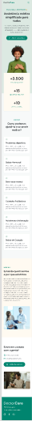

# Sobre o projeto

O projeto está sendo feito com o auxilio da semana:

"NLW RETUNN - MISSION ORIGIN"
 
feito pela [rocketseat](https://www.rocketseat.com.br), onde aprenderemos a criar uma pagina com responsividade e acessibilidade.

## Projeto

Projeto do [Figma](https://www.figma.com/file/kc59zTXoZq6mZ22lPfzZVE/DoctorCare-(Community)?node-id=1716%3A251)

projeto para desktop | projeto para mobile

## Tecnologias utilizadas

- HTML
- CSS
- JAVASCRIPT
